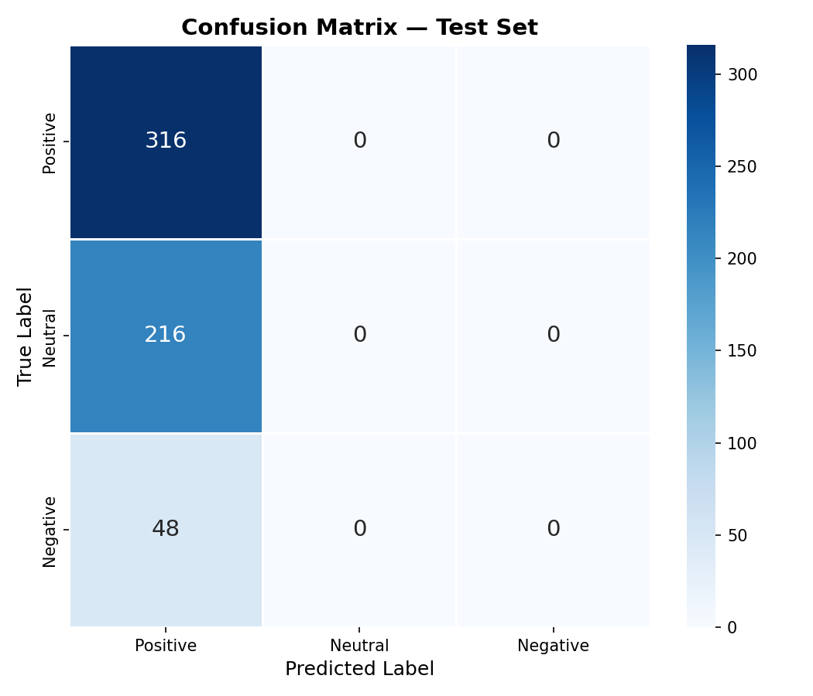
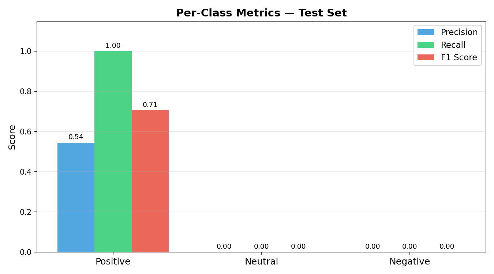
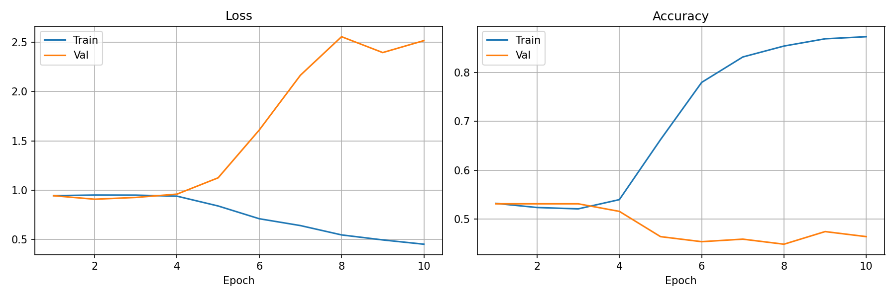

# Multimodel-Sentiment-Analysis
# 🧠 Multimodal Sentiment Analysis on MemoTion-7k

> Combining **Vision Transformers** and **Sentence-BERT** to classify meme sentiment as Positive, Neutral, or Negative.


---

## 📌 Overview

Memes communicate meaning through a fusion of image and text that neither modality can decode alone. A smiling face with a sarcastic caption reads as *Positive* visually but *Negative* textually. This project builds a multimodal deep learning system that reads both together.

**Task:** Given a meme image + its OCR text → predict sentiment (Positive / Neutral / Negative)  
**Dataset:** [MemoTion-7k](https://www.kaggle.com/datasets/williamscott701/memotion-dataset-7k) (SemEval-2020 Task 8)  
**Interface:** Gradio web app — upload image, paste text, get prediction instantly

---

## 🏗 Architecture

```
Image (224×224)              Text (OCR string)
      │                             │
 ViT-Base/16                 Sentence-BERT
 (ImageNet-21k)            (all-mpnet-base-v2)
      │                             │
 pooler_output [768]        pooler_output [768]
      │                             │
 Linear(768→256)            Linear(768→256)
 BatchNorm+ReLU+Dropout     BatchNorm+ReLU+Dropout
      │                             │
      └──────── Concat [512] ────────┘
                     │
          Linear(512→256→128→3)
                     │
       Positive  |  Neutral  |  Negative
```

| Component | Model | Params |
|-----------|-------|--------|
| Image Encoder | ViT-Base/16 (ImageNet-21k) | ~86M |
| Text Encoder | Sentence-BERT all-mpnet-base-v2 | ~110M |
| Fusion MLP | Linear(512→256→128→3) | ~200K |
| **Total** | | **~220M** |

---

## 📁 Project Structure

```
multimodal_sentiment/
├── app.py                   # Gradio interface
├── train.py                 # 5-fold training pipeline
├── evaluate.py              # Metrics + plots
├── config.py                # All hyperparameters
├── requirements.txt
├── data/
│   └── memotion_dataset.py  # Dataset loader + fold creation
├── models/
│   └── multimodal_model.py  # ViT + SBERT + Fusion MLP
├── utils/
│   └── seed.py
└── results/
    ├── best/                # Saved checkpoints per fold
    ├── training_curves.png
    ├── confusion_matrix.png
    ├── per_class_metrics.png
    └── metrics_summary.txt
```

---

## 📊 Dataset Setup

1. Download the dataset from Kaggle: [MemoTion-7k](https://www.kaggle.com/datasets/williamscott701/memotion-dataset-7k)
2. Place it in the project root:

```
multimodal_sentiment/
└── memotion_dataset_7k/
    ├── images/          ← 6,992 meme images
    ├── labels.csv       ← annotations
    └── labels.xlsx      ← (fallback)
```

**Label mapping used:**

| Original | Mapped |
|----------|--------|
| very positive / positive | Positive (0) |
| neutral | Neutral (1) |
| negative / very negative | Negative (2) |

> **Text column used:** `text_corrected` (OCR noise-corrected by human annotators — more reliable than `text_ocr`)

---

## ⚙️ Installation

```bash
git clone https://github.com/your-username/multimodal-sentiment-memotion.git
cd multimodal-sentiment-memotion

pip install -r requirements.txt
```

**Key dependencies:**
- `torch >= 2.0`
- `transformers >= 4.35`
- `sentence-transformers >= 2.2`
- `gradio >= 4.0`
- `albumentations >= 1.3`
- `timm >= 0.9`

---

## 🚀 Usage

### 1. Train

```bash
python train.py --data_dir ./memotion_dataset_7k --epochs 10
```

Trains all 5 folds by default. To train a single fold:

```bash
python train.py --fold 0
```

Checkpoints saved to `results/best/best_epoch-{fold}.pt`

### 2. Evaluate

```bash
python evaluate.py \
  --data_dir ./memotion_dataset_7k \
  --model    ./results/best/best_epoch-00.pt
```

Generates:
- `results/confusion_matrix.png`
- `results/per_class_metrics.png`
- `results/metrics_report.txt`

### 3. Launch Gradio App

```bash
python app.py --model ./results/best/best_epoch-00.pt
```

Open → `http://localhost:7860`

To create a public shareable link:

```bash
python app.py --model ./results/best/best_epoch-00.pt --share
```

---

## 📈 Results

| Metric | Score |
|--------|-------|
| Accuracy | 54.5% |
| Precision (weighted) | 0.30 |
| Recall (weighted) | 0.55 |
| F1-Score (weighted) | 0.38 |

### Confusion Matrix


### Per-Class Metrics


### Training Curves


---

## ⚠️ Known Issues & What Was Learned

The model collapses to predicting **Positive** for all samples. Two root causes were identified:

**1. Class Imbalance**
- MemoTion-7k distribution: ~54% Positive, ~31% Neutral, ~15% Negative
- Standard cross-entropy takes the easy path — always predict the majority class

**2. Overfitting**
- ViT + Sentence-BERT = ~220M parameters on only ~5,600 training samples
- Val loss diverges from epoch 5; model memorises instead of generalising

**Fixes (next steps):**
```python
# Fix 1 — Weighted loss
weights = torch.tensor([1.0, 1.75, 3.5]).to(device)  # inverse class freq
criterion = nn.CrossEntropyLoss(weight=weights)

# Fix 2 — Freeze backbone, train only fusion layers
for param in model.image_encoder.encoder.parameters():
    param.requires_grad = False
for param in model.text_encoder.encoder.parameters():
    param.requires_grad = False
# Now only ~200K params train instead of ~220M
```

---

## 🔧 Configuration

All hyperparameters are in `config.py` — edit before training:

```python
epochs        = 10
train_bs      = 16
learning_rate = 3e-4
dropout       = 0.3
num_folds     = 5
image_encoder = "google/vit-base-patch16-224"
text_encoder  = "sentence-transformers/all-mpnet-base-v2"
```

---

## 📚 References

1. Sharma et al. (2020). *SemEval-2020 Task 8: Memotion Analysis*. ACL Anthology.
2. Dosovitskiy et al. (2021). *An Image is Worth 16×16 Words*. ICLR 2021.
3. Reimers & Gurevych (2019). *Sentence-BERT*. EMNLP 2019.
4. Kiela et al. (2019). *Supervised Multimodal Bitransformers*. NeurIPS 2019.

---

## 📝 License

MIT License — free to use, modify, and distribute with attribution.

---

*ELC 2025-26 | Computer Vision | Thapar Institute of Engineering & Technology, Patiala*
